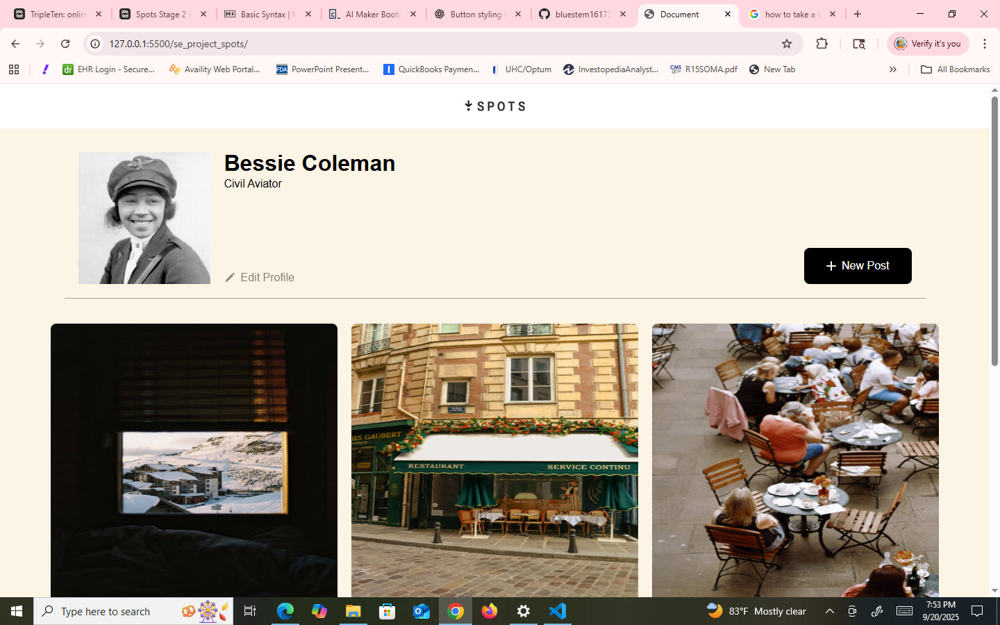
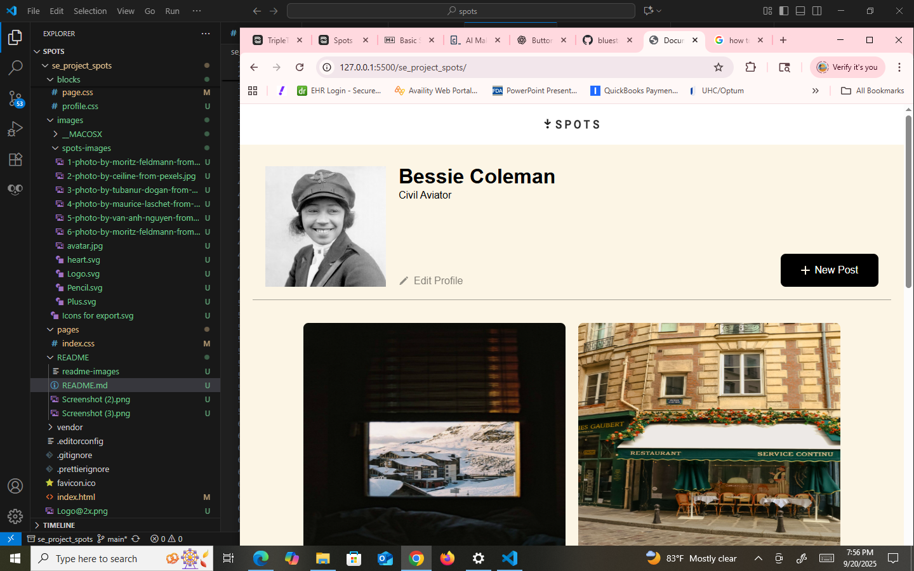
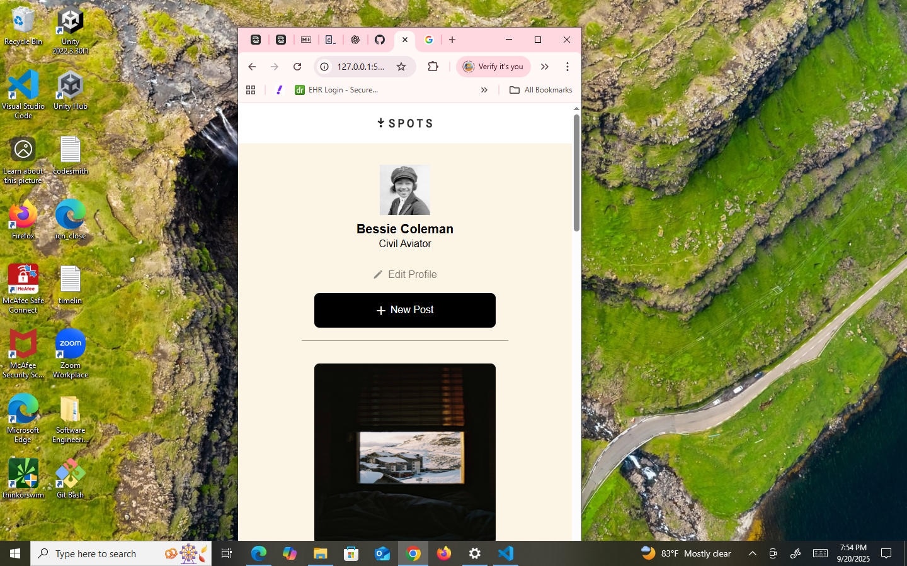

# Project 3: Spots

### Overview

- Intro
- Figma
- Images

**Intro**

This project is made so all the elements are displayed correctly on popular screen sizes. We recommend investing more time in completing this project, since it's more difficult than previous ones.

**Figma**

- [Link to the project on Figma](https://www.figma.com/file/BBNm2bC3lj8QQMHlnqRsga/Sprint-3-Project-%E2%80%94-Spots?type=design&node-id=2%3A60&mode=design&t=afgNFybdorZO6cQo-1)

**Images**

The way you'll do this at work is by exporting images directly from Figma — we recommend doing that to practice more. Don't forget to optimize them [here](https://tinypng.com/), so your project loads faster.

Good luck and have fun!

# Spots

This was a project to create a responsive web design project showcasing a profile section and card layouts built with **CSS Grid**, **Flexbox**, and **media queries**. The layout adapts across breakpoints, with attention to accessibility, semantic HTML, and BEM-style class naming.

## Live Demo

<!-- Replace <your-username> with your GitHub username -->

**GitHub Pages:** https://bluestem16173.github.io/se_project_spots/

## Features

- Responsive layout that adapts from mobile → tablet → desktop
- Profile section with “Edit” and “Add” buttons aligned via Flexbox
- Card grid built with CSS Grid (auto-fit/auto-fill) and gap-based spacing
- Accessible, semantic HTML (headings, alt text, focus states)
- BEM methodology for predictable, reusable CSS

## Tech & Techniques

- **HTML5** (semantic structure)
- **CSS3**: Flexbox, Grid, media queries
- **BEM** naming convention (`block__element--modifier`)
- **Responsive images** and typography
- Optional tooling: **Prettier** for formatting

## Screenshots

> Highly recommended—drop a few viewport sizes here.

<!-- Put your images in /images/readme/ and update the paths below -->

### Desktop (≥ 1024px)



### Tablet (~768px)



### Mobile (≤ 627px)



## Project Structure

```text
spots/
├─ index.html
├─ pages/
│  └─ index.css
├─ images/
│  ├─ spots-images/ (icons, assets used in UI)
│  └─ readme/       (screenshots for this README)
└─ favicon.ico
```

## Link to Github

https://github.com/bluestem16173/se_project_spots/settings/pages

## Link to Google Drive
https://drive.google.com/file/d/13lvMzoo0qU9uRT8MCy7hCoHi2ocDJAtv/view?usp=drive_link
https://drive.google.com/file/d/1SHZI3kntgbCuirIj4_2-iUx2H9bCzNGL/view?usp=drive_link